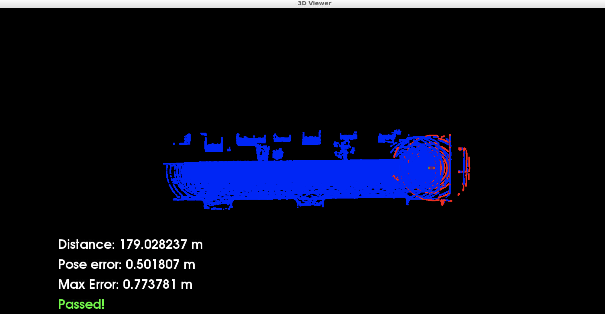

# SDCND04_Scan_Matching_Localization
This is project 4 of Udacity's "Self-Driving Car Engineer" Nanodegree Program focusing on scan matching algorithms for object localization using lidar point clouds.

The goal of this project is to localize a virtual car driving straight along a road in a simulated traffic scenario for at least 170m from the starting position never exceeding a 2D position error of 1.2 m at maximum. The virtual car in the simulation is equipped with a lidar sensor that scans its environment. The simulator provides lidar scans at regular intervals. Additionally, a point cloud map [map.pcd](./map.pcd) of the environment is provided. This point cloud map has been extracted from a demo environment of the [CARLA simulator](https://carla.org/). By using point registration matching between this point cloud map and the incoming lidar scans, localization for the car can be accomplished at every time step. Therefore, a transformation matrix is calculated that maps the lidar point cloud from the current scan in an optial way to the point cloud map. This transformation is used to correct the current pose estimate of the virtual car with resepct to the map.

## Setup and Usage
All the work is done in a pre-set virtual environment in a Udacity workspace. It contains a running installation of [CARLA simulator](https://carla.org/). All the dependencies to run the project are provided in this workspace. If you have a strong local system then you can get a performance/speed boost from setting up the simulation and running it there. The main function of the project code controlling the interaction with CARLA is implemented in the file [c3-main.cpp](./c3-main.cpp). The scan matching algorithms are implemented in [scm.cpp](./scm.cpp). The helper functions in [helper.cpp](./helper.cpp) are provided by Udacity. They have only been extended by an exponential averaging filter to monitor the pose estimation errors. As pure scan matching turns out to work only well if the initial guess for the starting pose of the scan matching iterations is rather close to the true pose of the vehicle, an Unscented Kalman Filter using an Ackermann bicycle model as 2D kinematic motion model has been additionally implemented in the file [ukf.cpp](./ukf.cpp). It can be used optionally and uses the pose estimated obtained scan matching localization as measurement updates. Furthermore, it reads the steering angle and the vehicle speed as additional measurement updates, which are assumed to be available in every vehicle, in order to support the scan matching process with better guesses of the current pose for the next scan matching iteration.

### Running the program
To run the program in the Udacity workspace the following steps need to be taken:

1. Compile the code (Terminal Tab 1)

```
cd /home/workspace/c3-project

cmake .

make
```

2. Launch the simulator in a new terminal tab (Terminal Tab 2)

```
su - student

cd /home/workspace/c3-project

./run-carla.sh
```

### Results

Using ICP resulted into a 0.95 max pose error:


While using NDT resulted into a 0.77 max pose error:

